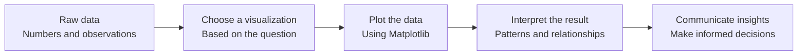

# Data Visualization

Machine learning models work with data, but understanding that data often starts with a picture. This project teaches you how to turn numbers into visualizations using Python and Matplotlib.

The goal is not just to create graphs. The goal is to understand what a visualization reveals: how values change over time, how variables relate to each other, how distributions behave, and how to present data so that patterns become easier to recognize.

## From numbers to insights



Imagine you have the daily temperatures of a city. A line graph helps you understand how temperatures change over time. A histogram reveals how frequently different temperatures occur. A scatter plot can help you investigate the relationship between temperature and electricity consumption.

The data stays the same, but the visualization changes what you can learn from it.

## Projects

| Topic                  | What you learn                                                     | Status    |
| ---------------------- | ------------------------------------------------------------------ | --------- |
| Plotting basics        | Create figures, plot data, and understand the Matplotlib workflow  | Core      |
| Scatter plots          | Explore relationships between two variables                        | Core      |
| Line graphs            | Visualize trends and changes over time                             | Core      |
| Bar graphs             | Compare values across categories                                   | Core      |
| Histograms             | Understand distributions and frequencies                           | Core      |
| Multiple plots         | Compare datasets using subplots and shared figures                 | Core      |
| Plot customization     | Add labels, titles, legends, ticks, and axis scales                | Core      |
| Advanced visualization | Explore three-dimensional plots and additional Matplotlib features | Extension |

## Where you will meet this again

Data visualization is a fundamental skill throughout machine learning and data analysis. It helps you understand your dataset before training a model, evaluate predictions, and communicate the results.

| Idea from this project  | Where it comes back                                                       |
| ----------------------- | ------------------------------------------------------------------------- |
| Scatter plots           | Exploring relationships between features and identifying correlations     |
| Line graphs             | Time-series analysis, forecasting, and monitoring model performance       |
| Bar graphs              | Comparing categories, model metrics, and feature importance               |
| Histograms              | Understanding distributions, detecting skewness, and identifying outliers |
| Axis scales             | Visualizing data with different magnitudes and distributions              |
| Multiple subplots       | Comparing datasets, experiments, and model predictions                    |
| Labels and legends      | Communicating results clearly in reports and dashboards                   |
| Three-dimensional plots | Exploring relationships between multiple variables                        |
| Data visualization      | Exploratory data analysis, model evaluation, and data storytelling        |

## Resources

**Read or watch:**

* [Plot (graphics)](https://intranet.hbtn.io/rltoken/swUAw_dV4-PhFth6wSzU1w)
* [Scatter plot](https://intranet.hbtn.io/rltoken/ukujmh-I_E6VTCLeJLiANw)
* [Line chart](https://intranet.hbtn.io/rltoken/gO3-Klt1z0tJeVU1aJD9qg)
* [Bar chart](https://intranet.hbtn.io/rltoken/JLN6oUJ6zbzZPW2i4Z_TaQ)
* [Histogram](https://intranet.hbtn.io/rltoken/FXDyUjw0H15E7AmmTo35LA)
* [Pyplot tutorial](https://intranet.hbtn.io/rltoken/OFIlhs5hVBKKb94LTPKJTw)
* [Matplotlib pyplot](https://intranet.hbtn.io/rltoken/rx6ItoEW_I7nK4nCex7lXQ)
* [Matplotlib plotting functions](https://intranet.hbtn.io/rltoken/Rw2oKb9JYJiMhnbPTUCUhA)
* [Matplotlib scatter](https://intranet.hbtn.io/rltoken/QmfwDDiu9-quaGgApMT6OA)
* [Matplotlib bar](https://intranet.hbtn.io/rltoken/rRktEeEVDCiYNmvx4SKcjA)
* [Matplotlib histogram](https://intranet.hbtn.io/rltoken/PKXgWPcvfmcpiGUKz6bE6Q)
* [Axis labels and titles](https://intranet.hbtn.io/rltoken/GISbsT3nJW7rEYoQAnSTKg)
* [Subplots and multiple figures](https://intranet.hbtn.io/rltoken/mBsd852vz8grSP5kvGhqhg)
* [Matplotlib axes legend](https://intranet.hbtn.io/rltoken/LBldwLJfzUYb_k63fgnsnQ)
* [Three-dimensional plotting](https://intranet.hbtn.io/rltoken/olLT2_Ce61FD4APHoTqb4Q)
* [Additional tutorials](https://intranet.hbtn.io/rltoken/ZuVz5fLoA3Aj-mSd9Ks6eQ)

## Learning Objectives

At the end of this project, you are expected to be able to explain to anyone, **without the help of Google**, the following concepts.

### General

* What is a plot?
* What is a scatter plot, line graph, bar graph, and histogram?
* What is Matplotlib?
* How to plot data using `matplotlib.pyplot`
* How to label a plot and add a title
* How to scale an axis and customize tick marks
* How to plot multiple datasets on the same figure
* How to organize multiple plots using subplots
* How to add legends to distinguish between datasets
* How to use logarithmic scales when appropriate
* How to create three-dimensional visualizations

## Requirements

### General

* Allowed editors: `vi`, `vim`, `emacs`
* All files will be interpreted using Ubuntu 20.04 LTS and Python 3.9.
* NumPy version: `1.25.2`
* Matplotlib version: `3.8.3`
* All files must end with a new line.
* The first line of every Python file must be exactly `#!/usr/bin/env python3`.
* A `README.md` file at the root of the project folder is mandatory.
* Code must follow `pycodestyle` version `2.11.1`.
* All modules must have documentation.
* All classes must have documentation.
* All functions, both inside and outside classes, must have documentation.
* Unless otherwise specified, importing modules is not allowed.
* All files must be executable.
* The length of files will be tested using `wc`.

## More Info

### Installing Matplotlib

Install the required dependencies in your Python environment:

```bash
pip install --user matplotlib==3.8.3
pip install --user Pillow==10.3.0
sudo apt-get install python3-tk
```

To verify that the packages have been installed, run:

```bash
pip list
```

Make sure you use the Python environment required by your project. If you are working in a virtual environment, install the dependencies inside that environment rather than mixing them with system Python packages.

## How to work through it

1. Read the project README and understand the purpose of each visualization before writing code.
2. Start with a small dataset and draw the expected graph on paper.
3. Implement the plot using Matplotlib and label the axes clearly.
4. Experiment with different inputs, axis scales, and plot types to understand how the presentation changes.
5. Test your functions with your own datasets, not only the examples provided.
6. Check the project requirements carefully, especially function documentation, executable permissions, and restrictions on imports.
7. Only then compare your results with the expected output.

The objective is to develop the ability to move from raw data to a clear visual explanation. This skill will become essential when exploring datasets, analyzing model predictions, and communicating machine learning results.
