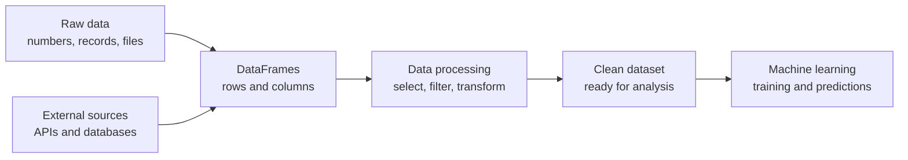

# Pipeline

Machine learning models depend on data, but raw data is rarely ready to use. This directory teaches you how to work with data before it reaches a model.

The goal is not just to manipulate tables. The goal is to understand how data is represented, organized, collected, and prepared: how to turn raw values into structured datasets that can be analyzed and used for machine learning.

## From raw data to models

Imagine collecting information about thousands of houses. The raw data might contain missing values, inconsistent formats, and irrelevant columns. Pandas helps organize the information into a DataFrame, manipulate its rows and columns, and prepare it for further analysis. APIs and databases provide additional ways to collect and store data.

## Projects

| Project | What you learn | Status |
|---------|----------------|--------|
| [pandas](./pandas) | Creating DataFrames, selecting data, indexing, manipulating columns, and visualizing datasets | Available |

## Where you will meet this again

Every skill here comes back later in the programme. Data preparation is an essential part of building reliable machine learning systems.

| Idea from this directory | Where it comes back |
|---------------------------|---------------------|
| DataFrames and tabular data | Exploratory data analysis and feature engineering |
| Selecting and filtering rows | Preparing training, validation, and test datasets |
| Indexing and column operations | Cleaning datasets and transforming features |
| Data types and missing values | Data preprocessing and reliable model inputs |
| Data visualization | Understanding distributions, patterns, and outliers |
| APIs and external data sources | Automated data collection and real-world ML pipelines |
| Structured data and databases | Storing, querying, and managing datasets at scale |

## How to work through it

1. Read the project README first. Understand the objective before writing code.
2. Work through small examples to understand how each operation changes the data.
3. Test your functions with different inputs, including empty datasets and unexpected values where appropriate.
4. Inspect the output of every operation. Check the shape, column names, data types, and values.
5. Run the provided tests and compare your results with the expected output.
6. Think about how each operation would help prepare a real dataset for analysis or machine learning.
