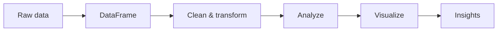

# Pandas

Pandas is a Python library for working with structured data. This directory teaches you how to load, clean, manipulate, analyze, and visualize datasets.

The goal is not just to memorize Pandas functions. The goal is to understand how data moves from a raw dataset to useful information that can be used for analysis and machine learning.

## From data to insights

A dataset can contain thousands of rows and many different columns. Pandas provides tools to organize this information into `DataFrame` and `Series` objects, making it easier to filter, transform, calculate statistics, and understand the data.

## Projects

| Project     | What you learn                                                                        | Status      |
| ----------- | ------------------------------------------------------------------------------------- | ----------- |
| [pandas](.) | DataFrames, Series, indexing, slicing, filtering, sorting, merging, and data analysis | In progress |

## Where you will meet this again

The concepts learned here are fundamental to data science and machine learning.

| Idea from this directory | Where it comes back                      |
| ------------------------ | ---------------------------------------- |
| DataFrames               | Dataset preparation and machine learning |
| Filtering                | Data cleaning and feature selection      |
| Grouping and aggregation | Exploratory data analysis                |
| Statistics               | Data analysis and model evaluation       |
| Visualization            | Understanding datasets and model results |

## How to work through it

1. Read the project README before starting.
2. Understand each Pandas operation with a small example.
3. Test your code with different datasets and inputs.
4. Follow the Holberton requirements and coding standards.
